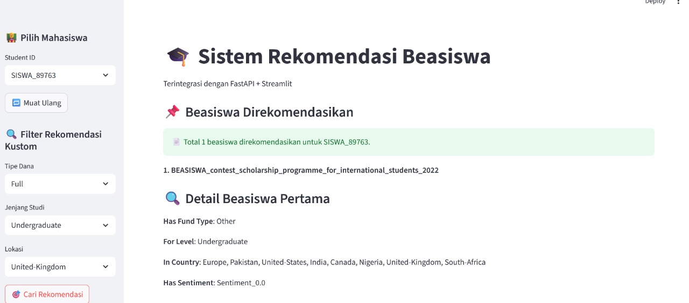

# Beasiswa App – Pengembangan Aplikasi Rekomendasi Beasiswa Berbasis Knowledge Graph Dengan Integrasi Fastapi, Streamlit, Dan Docker
Aplikasi ini merupakan sistem rekomendasi beasiswa berbasis *Knowledge Graph* yang dibangun dengan Python, FastAPI (sebagai backend), dan Streamlit (sebagai frontend). Dataset mahasiswa dan beasiswa diproses dan dikaitkan dalam bentuk graf menggunakan NetworkX. Aplikasi ini dikemas dalam container Docker dan diunggah ke DockerHub untuk memudahkan deployment.

## Teknologi yang Digunakan
- Python, Pandas, Scikit-Learn, TextBlob
- NetworkX & PyVis (visualisasi graf)
- FastAPI (REST API), Streamlit (antarmuka web)
- Docker (containerization)
- Ngrok (tunneling opsional)

## Struktur Proyek
beasiswa-app/  
  ├── app.py  
  ├── beasiswa.py   
  ├── Dockerfile    
  ├── requirements.txt    
  ├── student-por.csv                          
  └── Universities_Schoolarships_All_Around_the_World.csv 

## Cara Menjalankan
docker build -t beasiswa-app  
docker run -p 8000:8000 -p 8501:8501 beasiswa-app

FastAPI: http://localhost:8000  
Streamlit: http://localhost:8501

## DockerHub 

Pull image langsung:

docker pull fahimahmad33/beasiswa-app:latest

🔗 https://hub.docker.com/r/fahimahmad33/beasiswa-app

## Fitur
- Rekomendasi beasiswa berbasis nilai dan perilaku
- Filter berdasarkan negara, jenjang studi, dan jenis dana
- Visualisasi graf hubungan mahasiswa dan beasiswa
- Integrasi API + UI secara lokal dan online (ngrok)
  
## 🖼️ Preview Antarmuka Aplikasi

Berikut adalah tampilan antarmuka dari sistem rekomendasi beasiswa:

